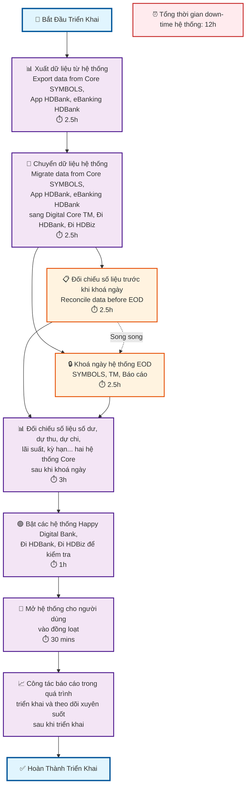
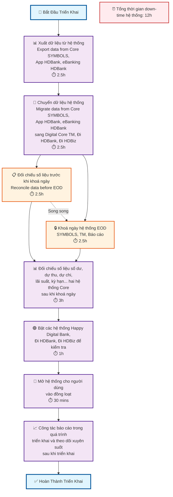
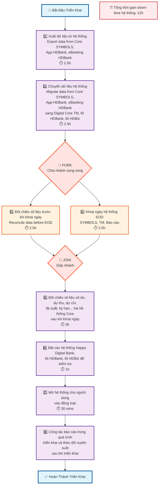

# Quy Trình Triển Khai Hệ Thống Ngân Hàng Số

## Flowchart Mô Tả Quy Trình

### Phiên Bản 1: Cấu Trúc Dọc (TD)



### Phiên Bản 2: Thể Hiện Song Song Rõ Ràng



### Phiên Bản 3: Cấu Trúc Song Song Thực Sự với Subgraph

```mermaid
flowchart TD
    A[🚀 Bắt Đầu Triển Khai] --> B[📊 Xuất dữ liệu từ hệ thống<br/>Export data from Core SYMBOLS,<br/>App HDBank, eBanking HDBank<br/>⏱️ 2.5h]
    
    B --> C[🔄 Chuyển dữ liệu hệ thống<br/>Migrate data from Core SYMBOLS,<br/>App HDBank, eBanking HDBank<br/>sang Digital Core TM, Đi HDBank, Đi HDBiz<br/>⏱️ 2.5h]
    
    C --> subgraph PARALLEL ["🔄 THỰC HIỆN SONG SONG"]
        direction LR
        D[📋 Đối chiếu số liệu trước khi khoá ngày<br/>Reconcile data before EOD<br/>⏱️ 2.5h]
        E[🔒 Khoá ngày hệ thống EOD<br/>SYMBOLS, TM, Báo cáo<br/>⏱️ 2.5h]
    end
    
    D --> F[📊 Đối chiếu số liệu số dư, dự thu, dự chi,<br/>lãi suất, kỳ hạn... hai hệ thống Core<br/>sau khi khoá ngày<br/>⏱️ 3h]
    
    E --> F
    
    F --> G[🟢 Bật các hệ thống Happy Digital Bank,<br/>Đi HDBank, Đi HDBiz để kiểm tra<br/>⏱️ 1h]
    
    G --> H[👥 Mở hệ thống cho người dùng<br/>vào đồng loạt<br/>⏱️ 30 mins]
    
    H --> I[📈 Công tác báo cáo trong quá trình<br/>triển khai và theo dõi xuyên suốt<br/>sau khi triển khai]
    
    I --> J[✅ Hoàn Thành Triển Khai]
    
    %% Time annotations
    K[⏰ Tổng thời gian down-time hệ thống: 12h]
    
    %% Styling
    classDef startEnd fill:#e1f5fe,stroke:#01579b,stroke-width:3px
    classDef process fill:#f3e5f5,stroke:#4a148c,stroke-width:2px
    classDef parallel fill:#fff3e0,stroke:#e65100,stroke-width:2px
    classDef time fill:#ffebee,stroke:#c62828,stroke-width:2px
    classDef subgraphStyle fill:#f0f8ff,stroke:#4169e1,stroke-width:2px
    
    class A,J startEnd
    class B,C,F,G,H,I process
    class D,E parallel
    class K time
    class PARALLEL subgraphStyle
```

### Phiên Bản 4: Cấu Trúc Fork-Join với Số Thứ Tự



## Chi Tiết Các Bước Triển Khai

### 1. Xuất Dữ Liệu (2.5h)
- **Mục tiêu**: Xuất toàn bộ dữ liệu từ hệ thống cũ
- **Hệ thống nguồn**: Core SYMBOLS, App HDBank, eBanking HDBank
- **Thời gian**: 2.5 giờ

### 2. Chuyển Dữ Liệu (2.5h)
- **Mục tiêu**: Di chuyển dữ liệu sang hệ thống mới
- **Hệ thống đích**: Digital Core TM, Đi HDBank, Đi HDBiz
- **Thời gian**: 2.5 giờ

### 3️⃣ Đối Chiếu Trước EOD (2.5h) - SONG SONG
- **Mục tiêu**: Đảm bảo tính chính xác của dữ liệu trước khi khoá ngày
- **Thời gian**: 2.5 giờ
- **Thực hiện song song với bước 4**

### 4️⃣ Khoá Ngày Hệ Thống (2.5h) - SONG SONG
- **Mục tiêu**: Thực hiện End of Day cho các hệ thống
- **Hệ thống**: SYMBOLS, TM, Báo cáo
- **Thời gian**: 2.5 giờ
- **Thực hiện song song với bước 3**

> **Lưu ý**: Bước 3️⃣ và 4️⃣ chạy song song từ điểm C (Chuyển dữ liệu), giúp tiết kiệm thời gian tổng thể

### 5️⃣ Đối Chiếu Sau EOD (3h)
- **Mục tiêu**: Kiểm tra số dư, dự thu, dự chi, lãi suất, kỳ hạn
- **Thời gian**: 3 giờ

### 6️⃣ Kích Hoạt Hệ Thống Mới (1h)
- **Mục tiêu**: Bật và kiểm tra các hệ thống mới
- **Hệ thống**: Happy Digital Bank, Đi HDBank, Đi HDBiz
- **Thời gian**: 1 giờ

### 7️⃣ Mở Cho Người Dùng (30 phút)
- **Mục tiêu**: Cho phép người dùng truy cập đồng loạt
- **Thời gian**: 30 phút

### 8️⃣ Báo Cáo và Giám Sát
- **Mục tiêu**: Theo dõi và báo cáo liên tục
- **Thời gian**: Liên tục

## Tổng Kết

- **Tổng thời gian down-time**: 12 giờ
- **Các bước song song**: 
  - **Bước 3️⃣** (Đối chiếu trước EOD) và **Bước 4️⃣** (Khoá ngày hệ thống)
  - Cả hai bước đều bắt đầu từ điểm C (Chuyển dữ liệu)
  - Cả hai bước đều kết thúc tại điểm F (Đối chiếu sau EOD)
- **Rủi ro cao nhất**: Bước 5️⃣ (đối chiếu sau EOD)
- **Thời gian quan trọng**: Bước 7️⃣ (mở cho người dùng)
- **Lợi ích song song**: Tiết kiệm 2.5 giờ so với thực hiện tuần tự
